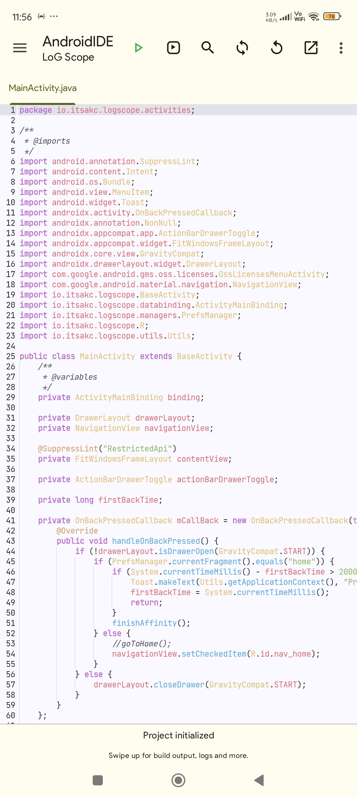
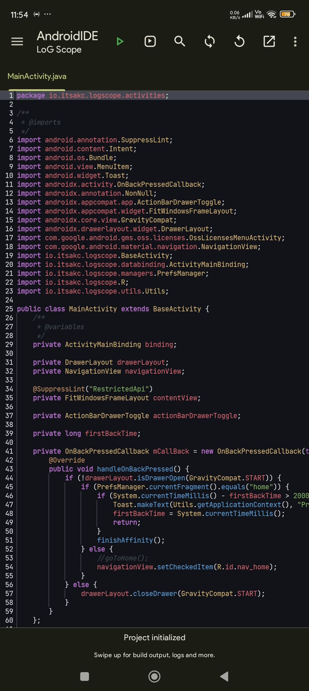

# 🌃 OneDarkPro - AndroidIDE
This is a very soothing pastel color scheme for AndroidIDE's programmers based on a very popular VSCode Atomic OneDark-Pro color scheme.

## Preview
• Light Background


• Dark Background


## How To Install?
First go to AndroidIDE Terminal and then run these commands.

• ```pkg i git -y```
<br />
• ```cd $HOME/.androidide/ui/editor/schemes```
<br />
• ```git clone https://github.com/itsakc-me/OneDarkPro-AndroidIDE```
<br />
• ```cp -r OneDarkPro-AndroidIDE/onedark\ pro .``` (Light Background)
<br />
• ```cp -r OneDarkPro-AndroidIDE/onedark\ pro-dark .``` (Dark Background)
<br />
• ```exit```

Now force stop AndroidIDE and re-open to parse all schemes present.

## How To Setup?
Open AndroidIDE navigate to -
<br />
Preferences > Editor > Color Scheme.

Now tap on it and simply choose ***OneDark Pro***.

That's it, now you successfully installed ***OneDark Pro*** color scheme.

## Special Thanks To.
• [Akash Yadav](https://github.com/itsaky) - [AndroidIDE](https://github.com/itsaky/AndroidIDE).
<br />
- For Providing A Beautiful IDE.

## Regards.
Thanks for choosing ***OneDark Pro***.
